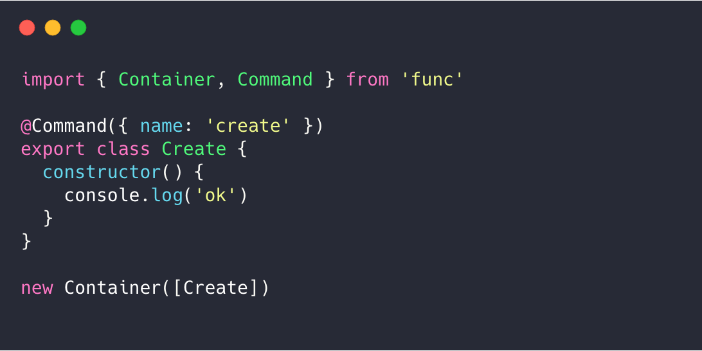

 

## FUNC

 

More popular and simple way to build command-line tools.

 

## Feature

- Very small volume ≈ [7kb](https://github.com/unix/func/blob/master/examples/gzbundle/archived.tar.gz)

- Elegant grammar

- Very few dependencies, maximum optimized running speed and `npm` download time

- Template support, best practices right away

 

## Quick Start

Just run `npm init func` to create project.

1. `npm init func`: create project

2. `npm i`: install deps.

3. `npm start`: setup link and development ready.

It's all.

 

## Documentation

- [func.unix.bio](https://func.unix.bio)

 

## Thanks

Thanks to [Shannon Moeller](https://github.com/shannonmoeller) for donating the pkgname "func" on npm!

 

## LICENSE

[MIT](./LICENSE)
