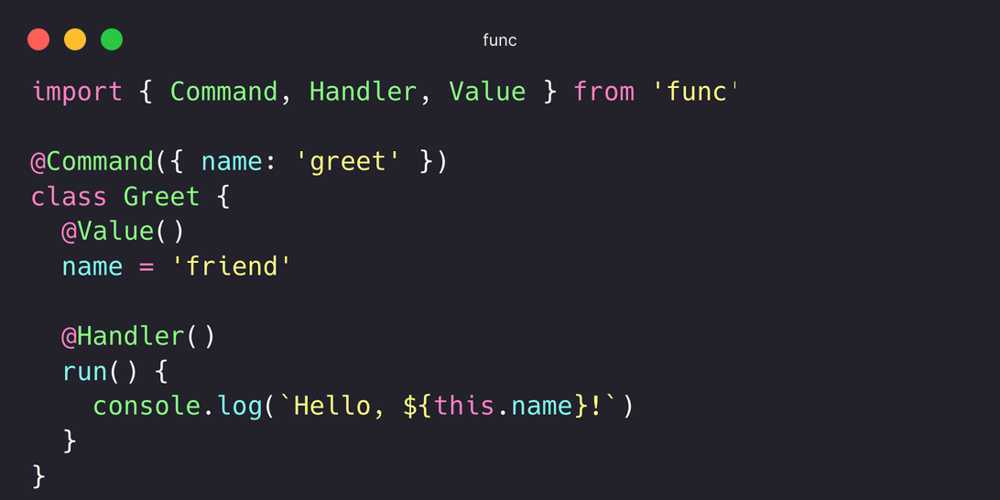

<p width="640" height="320" align="center">

</p>
<br/>

## FUNC

A tiny decorator-based CLI framework for TypeScript.

`func` helps you build command-line tools with class decorators, typed runtime
context injection, a small production footprint, and a template workflow that is ready
to use from the first command.

<br/>

## Features

- Tiny production bundles by default, making your CLI easy to install, quick to
  ship, and lightweight to distribute. See a reference output
  [here](https://github.com/unix/func/blob/main/examples/gzbundle/archived.tar.gz).

- Class decorators for commands, command options, and application modules.

- Typed context injection for parsed inputs, option values, and registered metadata.

- Very few runtime dependencies, keeping installation and startup lightweight.

- Project template support with built-in development and build commands.

<br/>

## Quick Start

We recommend starting every new project from the official template:

```sh
npm init func
```

The generated project already includes the standard `func` setup, development
script, build script, and package configuration.

If you need to build without the template, browse the
[examples](./examples) folder for small project structures and usage patterns.

<br/>

## Documentation

- [func.witt.im](https://func.witt.im)
<br/>

## Thanks

Thanks to [Shannon Moeller](https://github.com/shannonmoeller) for donating the
pkgname "func" on npm!

<br/>

## LICENSE

[MIT](./LICENSE)
